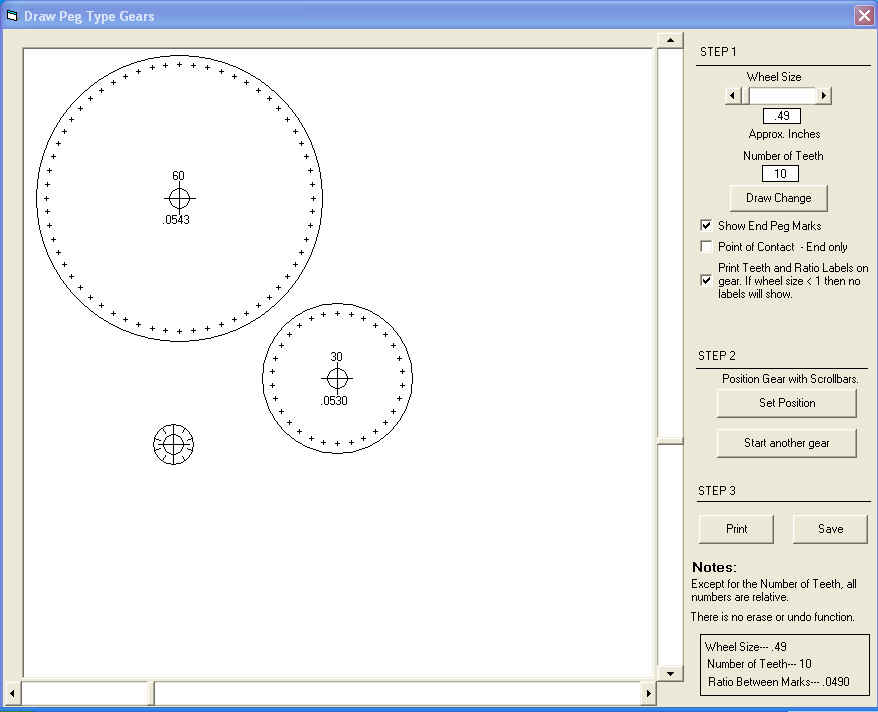



## Draw Peg Style Gear Templates

### Description

Will draw a gear, the size and number of teeth you want. Can do several at one time. Its crude,but with a little care, it did what I wanted.Has Print and Save functions.
 
### More Info
 

             |
---                |---
**Submitted On**   |2008-05-24 14:24:30
**By**             |[Kenneth Foster](https://github.com/Planet-Source-Code/PSCIndex/blob/master/ByAuthor/kenneth-foster.md)
**Level**          |Intermediate
**User Rating**    |4.0 (8 globes from 2 users)
**Compatibility**  |VB 6\.0
**Category**       |[Miscellaneous](https://github.com/Planet-Source-Code/PSCIndex/blob/master/ByCategory/miscellaneous__1-1.md)
**World**          |[Visual Basic](https://github.com/Planet-Source-Code/PSCIndex/blob/master/ByWorld/visual-basic.md)
**Archive File**   |[Draw\_Peg\_S2113785242008\.zip](https://github.com/Planet-Source-Code/kenneth-foster-draw-peg-style-gear-templates__1-70576/archive/master.zip)

